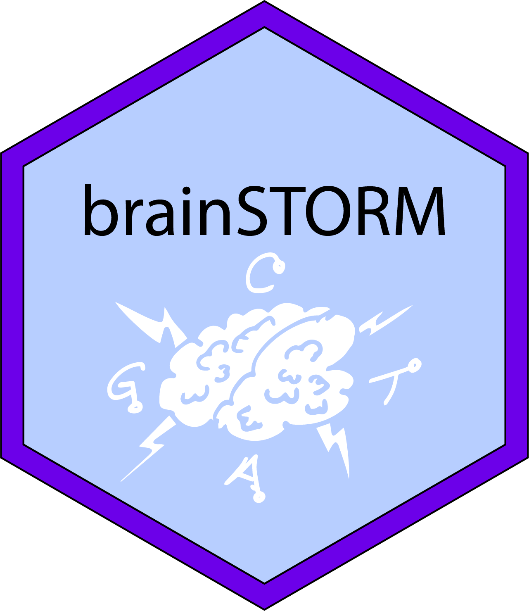

```{r, include = FALSE}
knitr::opts_chunk$set(
    collapse = TRUE,
    comment = "#>",
    fig.path = "man/figures/README-"
)
```

# brainSTORM </a>


<!-- badges: start -->
`r badger::badge_devel("SchwartzLab/brainSTORM", "blue")`
<!-- badges: end -->

## Description 

**brainSTORM** is a package that processes STORMseq-based data, making use of 
the [**txtools**](https://github.com/AngelCampos/txtools) package.

## Installation

You can install the development version from
[GitHub](https://github.com/SchwartzLab/brainSTORM) typing in the following 
commands in the R console:

```{r, installation, eval = F}
if (!requireNamespace("remotes", quietly = TRUE))
    install.packages("remotes")
remotes::install_github("SchwartzLab/brainSTORM", build_vignettes = FALSE)
```

If you want to build the vignette, please install with the following command 
(only works while connected to WEXAC).

```{r, eval = F}
if (!requireNamespace("remotes", quietly = TRUE))
    install.packages("remotes")
remotes::install_github("SchwartzLab/brainSTORM", build_vignettes = TRUE)
```

## Further documentation

To open the "Using brainSTORM at WEXAC" vignette run the following command.

```{r, eval = F}
vignette("Using_brainSTORM_at_WEXAC", package = "brainSTORM")
```
    
## Current limitations

## Licence

brainSTORM is developed under the [Artistic Licence 2.0](https://opensource.org/licenses/Artistic-2.0).

